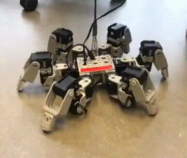
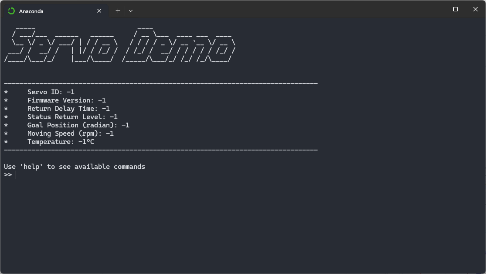

# dynamixel-ax-12a-servo 
Driver for the Dynamixel AX 12A servo in Python. This is not a standalone version.
This module provides an interface to send commands to either a single servo with a given ```ID``` or to multiple servos simultaneously. 

## Demo



## Servo Demo
This library and the dynamixel AX 12A servo can be tested with a provided  module. The demo provides several options to interact with the connected servos, e.g. ```show connected devices```, ```set id```, ```set speed```, ```set angle``` etc. Also a pytest sample is provided, which tests several positions, speeds, limits and provides a plot over time of the measured max supported speed of a given servo. 




